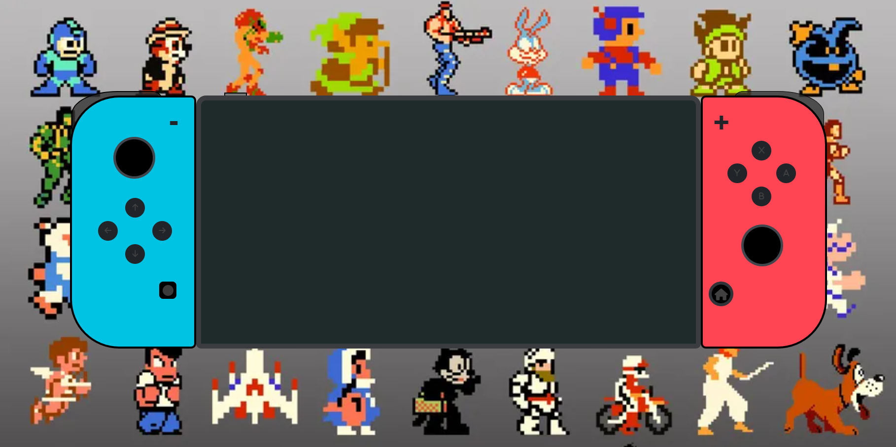

Hola, he realizado la programación de una consola en este caso una Nintendo Switch

    los lenguajes utilizados son los siguentes lenguajes de programación 
    Html, CSS y JavaScript y con la ayuda de BOOTSTRAP.

    uso: tiene un boton principal de "Start" colocado a la izquierda de la pantalla, sin darle a  este boton 
    no se encienden los demas botones.
        una vez pulsado el start se encienden los demas botones y se puede interactuar con ellos.
            los botones de la Izquierda son 4 fotos "NO RESPONSIVE"
            los botones de la Derecha son 4 video responsive.
            los demas botones solo tienen un console(log);

    fallos reconocidos : > las 4 imagenes que se activan con los botones (flechas) no son responsive.

                         >La consola tiene pequeños detalles en responsive que no quedan del todo bien,
                         y el boton cuadrado del mando izquierdo deberia quedar todo el rato pegado al
                         borde izquierdo, pero en responsive se va a la derecha.

    la consola: 
        
   

